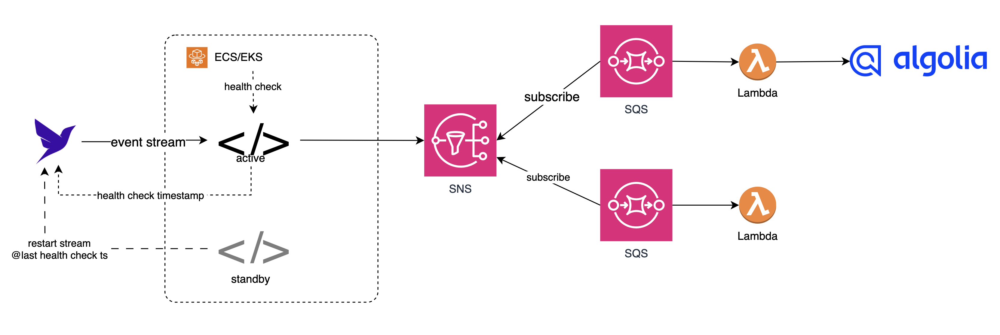

# Event Streaming sidecar for CDC

This is sample code for how to build a restartable stream client without losing any events. Fauna event streams can be "restarted" with an old stream token using a backdated `start_ts` option (so long as the `start_ts` is > the stream token creation time). Using this feature, we simply have to store the timestamp of healthcheck ping and use it the latest value (to restart the Fauna event stream) in the event the server needs to be restarted.  




## Setup
1. Setup venv environment
  * `python3 -m venv venv`
  * `source venv/bin/activate`
  * `pip install -r requirements`
2. Copy `.env.sample` into a new file called `.env` and provide a value for `FAUNA_SECRET`
3. Create a collection in your database called `healthcheck_ts`. Use the schema definitions found in the sample [main.fsl](./main.fsl) file, i.e.
  ```
  collection healthcheck_ts {
    history_days 0
    ttl_days 1
    index last_ping {
      values [desc(.ping)]
    }
  }
  ```
4. In the [appserver.py](./appserver.py) file, replace the sample stream query with your own:
  ```
  #----------------------------------#
  # your stream query here
  #----------------------------------#
  q = fql('Foo.all().toStream()')   <--- edit this
  ```

## Test it
* `python appserver.py`
  ```
  > python appserver.py                                                    
  * Serving Flask app 'appserver'
  * Debug mode: off
  WARNING: This is a development server. Do not use it in a production deployment. Use a production WSGI server instead.
  * Running on http://127.0.0.1:5000
  Press CTRL+C to quit  
  ```
* Make mutations to the set you are streaming (from step 4 above) and watch the stream events print out on the console
* Test the healthcheck: `curl --location 'http://127.0.0.1:5000/health'`
   * Check the collection `healthcheck_ts` and verify there's a new document created with a `ping` and `stream_token` fields populated
* Kill the appserver.py
* Make some more mutations
* Restart the appserver `python appserver.py`
  * The mutations from the previous step would have streamed out upon startup